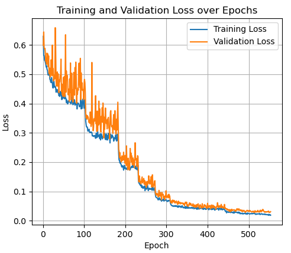
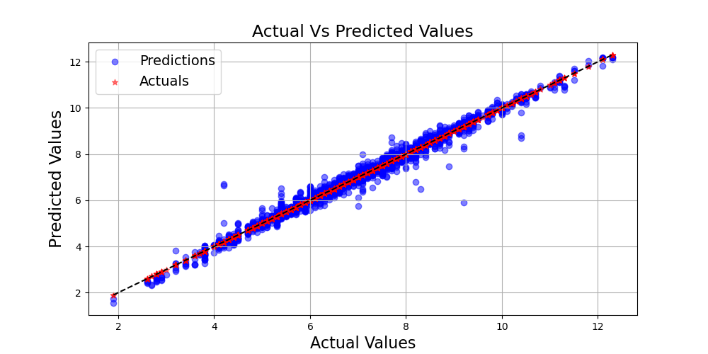

# Hybrid CNN-transformer model for SSC prediction in Norwegian wild blueberries 🍇📊
 
  Soluble solids content (SSC), an accepted measure of sweetness, is an important quality attribute for blueberries.
  A new hybrid deep learning (DL) model, NorBlueNet, is developed, integrating CNN
 and transformer layers for predicting the SSC values in blueberries which synergistically leverages local and
 global feature extraction capabilities. This research pioneers the application of a tailored model to accurately
 predict SSC in Norwegian wild blueberries, overcoming the challenges posed by their miniature size.  
 This code is based on the paper:
NorBlueNet: Hyperspectral imaging-based hybrid CNN-transformer model for non-destructive SSC analysis in Norwegian wild blueberries
Shanthini K.S., Sudhish N. George, Athul Chandran O.V, Jinimol K.M., Keerthana P., Jobin Francis and Sony George.

  #  Key Features 🔑 
A novel hybrid CNN-transformer architecture, synergistically integrating convolutional layers’ spatial detail with transformers’ long-range dependency modelling capabilities.

CNN captures local patterns while transformer focuses on long-range dependencies.
  
Enhanced accuracy while maintaining computational efficiency.

Enables rapid, non-destructive SSC analysis in Norwegian wild blueberries.

This approach combines the precision of hyperspectral imaging with the predictive power of deep learning.

# Requirements 🔧

Pytorch.

# Training
 

# SSC prediction 📷

 Scatter plot

# Code  📂

This code is based on the paper 

Shanthini, K. S., George, S. N., OV, A. C., Jinumol, K. M., Keerthana, P., Francis, J., & George, S. (2025), "NorBlueNet: Hyperspectral imaging-based hybrid CNN-transformer model for non-destructive SSC analysis in Norwegian wild blueberries", Computers and Electronics in Agriculture, 235, 110340.

https://authors.elsevier.com/a/1kvgAcFCSf4oo    or

https://www.sciencedirect.com/science/article/pii/S0168169925004466

    
